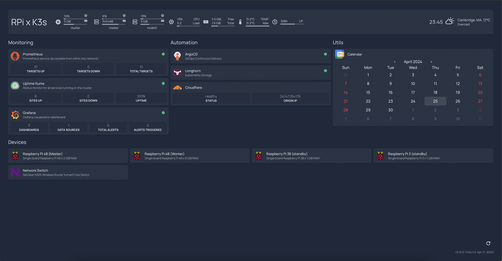

<!-- PROJECT LOGO -->
 

  

  <h1 align="center">Homelab</h1>

  

    An awesome guide to home-labbing on a budget!
     
    <a href="https://github.com/sydrawat01/homelab/tree/master/docs"><strong>Explore the docs »</strong></a>
     
     
  

  <a href="https://sydrawat.me"><strong>Visit my Homelab!</strong></a>

<!-- ABOUT THE PROJECT -->
## About the Project

  
  
  
  
  
  
  

After much lurking on [r/homelab](https://www.reddit.com/r/homelab/) and [r/selfhosted](https://www.reddit.com/r/selfhosted/), I decided to put my Kubernetes skills to the test and create a simple homelab using the Raspberry Pis' I had lying around the house.

Building your own homelab offers a myriad of benefits that can significantly enhance your learning, experimentation, and professional development in the field of technology. This homelab is just the first step into the big world of self-hosted applications. Right now, this is at a _"personal project for development"_ level.

> \[!NOTE]\
> I'm in the process of creating a neat cluster with a basic Raspberry Pi case which can hold up to 4 Pis'. I'll add an image of my cluster when it's ready! Till then, hold your horses!

<!-- WHY KUBERNETES -->
## Why Kubernetes?

Using Kubernetes for a homelab environment offers several compelling advantages:

- Kubernetes enables you to orchestrate containerized applications efficiently, allowing you to deploy, scale, and manage software with ease. This is particularly beneficial for homelab enthusiasts who want to explore modern application architectures and microservices-based deployments.
- Provides a standardized platform for running applications across different environments, making it easier to migrate projects between your homelab and cloud-based infrastructure.
- Offers robust scheduling and resource management capabilities, optimizing the utilization of your homelab hardware and enabling you to run multiple workloads simultaneously without compromising performance.
- Leveraging Kubernetes in your homelab will help you gain valuable experience with a widely-used technology found in enterprise-level production systems.

<!-- WHY RASPBERRY PI -->
## Why Raspberry Pi?

Despite its modest hardware specifications, Raspberry Pi packs enough computing power to serve as a capable platform for various projects, including setting up a Kubernetes cluster. Its compact size makes it ideal for building homelab environments without the need for expensive hardware.

<!-- K3S -->
## K3s

K3s is a lightweight Kubernetes distribution developed by Rancher Labs, specifically optimized for resource-constrained environments such as IoT devices and edge computing. Its minimalistic design and reduced memory footprint make it well-suited for running Kubernetes clusters on Raspberry Pi clusters. K3s retains all the essential features of Kubernetes while simplifying the installation process and consuming fewer system resources, making it an excellent choice for hobbyists and enthusiasts looking to explore Kubernetes on Raspberry Pi setups.

<!-- ANSIBLE -->
## Ansible

Ansible is a radically simple IT automation system. It handles configuration management, application deployment, cloud provisioning, ad-hoc task execution, network automation, and multi-node orchestration. Ansible makes complex changes like zero-downtime rolling updates with load balancers easy.

The technology has been used for the automation of the initial cluster setup. There are few prerequisites for the k3s Ansible playbook to work:

- The playbook has updated IP addresses of the Kubernetes nodes.
- The PC executing Ansible should have access to each node.
- The access should be password-less (Either not use password at all or use Public and Private Keys)
- In case of the Public and Private key authentication, the SSH fingerprints needs to be accepted beforehand

<!-- GETTING STARTED -->
## Getting Started

You can explore the [docs](./docs/) as per your needs. If you need a starting point, I'd suggest starting with the [docs/00_hardware.md](./docs/00_hardware.md) to get started with a base idea on what you want to build.

For a more complex, comprehensive setup with ArgoCD, and following the best GitOps practices, I would start off with [docs/13_argocd.md](./docs/13_argocd.md).

> \[!IMPORTANT]\
> Only start at `ArgoCD` if you know what you are doing! In any case, I suggest going through the rest of the [docs](./docs/) before starting off with `ArgoCD` to configure your homelab cluster.

<!-- BUILT WITH -->
## Built With

  
  
  
  
  

<!-- LICENSE -->
## License

Distributed under the MIT License. See [`LICENSE`](./LICENSE) for more information.
