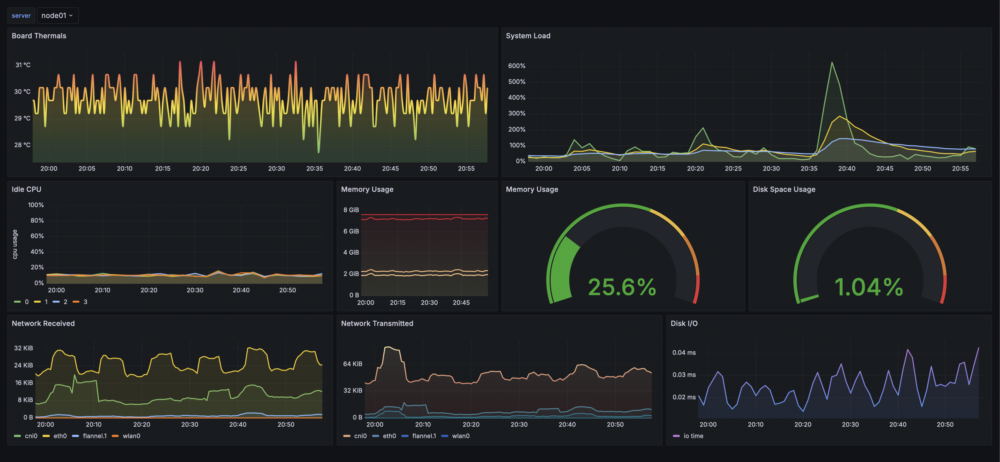
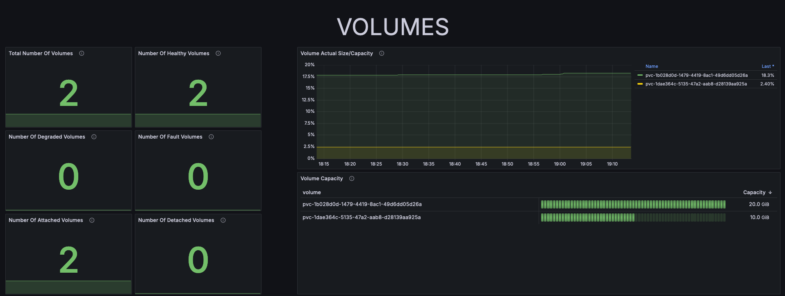
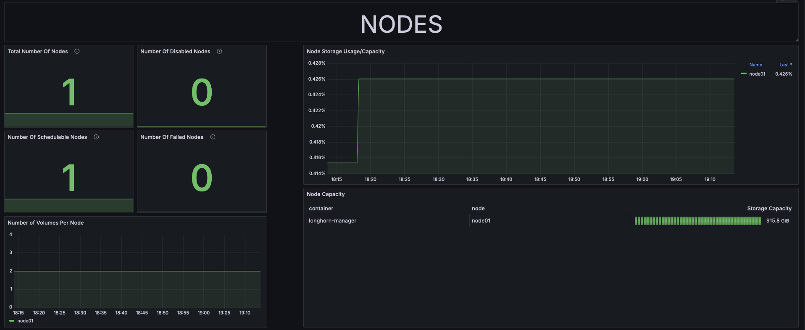
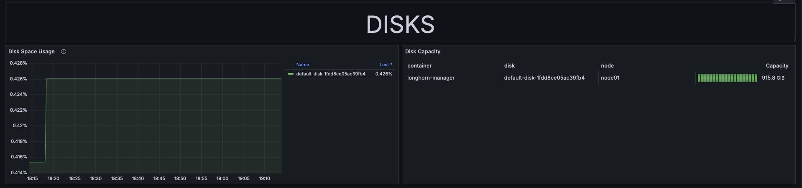
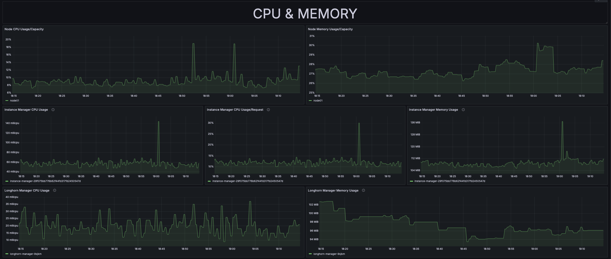

# Grafana Dashboards

First thing to do with your grafana dashboard is to update the `admin` password.

## Data Source

We need to define where `Grafana` will get it's data from, so we need to define a data source for it.

1. Under `Connections` -> `Data sources`, click on `Add new data source`.
2. Choose `Prometheus` from the list of data sources.
3. The `Connection URL` for our prometheus data source will be the `MetalLB` provided external IP that we configured in `prometheus-service-ext.yaml` [here](../config/monitoring/prometheus/prometheus-service-ext.yaml#15), `http://10.0.0.205:9090`.
4. If you're not using a LoadBalancer for your services, you can also use the `ClusterIP` from the `prometheus-service-local.yaml`.
5. If you are not sure, run the following command to get a better picture of what your data source should be:

    ```bash
    kubectl get service -n monitoring | grep 'prometheus'
      prometheus-external   LoadBalancer   10.43.51.184    10.0.0.205    9090:31844/TCP      6d6h
      prometheus            ClusterIP      10.43.198.206   <none>        9090/TCP            6d6h
    ```

6. From the above, we can use any of the three URLs for the prometheus data source:
   1. `10.0.0.205:9090`
   2. `prometheus-external:9090`
   3. `10.43.198.206:9090`
7. At the bottom click `Save & Test`. This should check and save the data source.

## Graphs

Importing graphs into Grafana is pretty straightforward. Here's my customized version of the `Kubernetes Dashboard` grafana dashboard: [`../dashboards/Kubernetes Nodes (w  Thermals).json`](../dashboards/Kubernetes%20Nodes%20(w%20%20Thermals).json).

Here are some juicy pictures from the dashboard:

> \[!NOTE]\
> The thermals shown are for my Raspberry Pis.









[Prev: Monitoring: Grafana](./11_monitoring_grafana.md) | [Next: GitOps: ArgoCD](./13_argocd.md)
